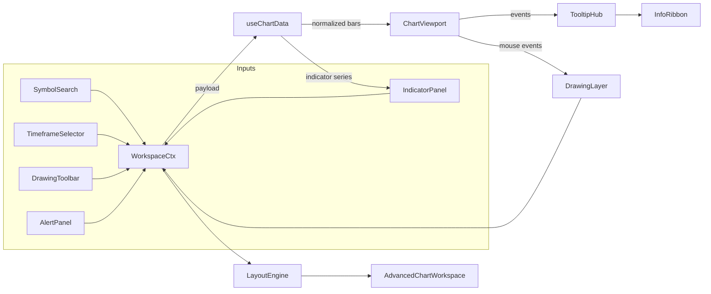

# Advanced Chart Workspace Architecture

This document defines the blueprint for matching TradingView-scale functionality. It must be kept in sync with `components/charting/*` implementations.

## Module Map
| Module | Responsibility |
| --- | --- |
| `ChartWorkspaceContext.tsx` | Central React context storing symbol, timeframe, chart type, overlays, indicators, drawings, layout config, theme, and alert definitions. Provides reducer-driven updates w/ console traces. |
| `useChartData.ts` | Data service hook that fetches OHLCV, quote metadata, and indicator payloads from API routes. Handles caching, retries, exponential back-off, streaming fallback, and exposes loading/error states. |
| `AdvancedChartWorkspace.tsx` | Top-level orchestrator that composes toolbar, watchlist, info ribbon, viewport panes, indicator panel, and alert manager. |
| `ChartViewport.tsx` | Wrapper around `lightweight-charts` that renders price, volume, and overlay series plus attaches event bus for crosshair + tooltip streaming. |
| `IndicatorPanel.tsx` | UI for adding/removing/configuring indicators, toggling pane placement, and editing parameters. |
| `DrawingLayer.tsx` | SVG overlay handling drawing tools (trendline, ray, rectangle, fib stub) with undo/redo + selection interactions. |
| `AlertPanel.tsx` | Allows user to drop price alerts (horizontal line) and configure conditions; synchronizes with workspace state. |
| `Docs/*.md` | Flowcharts + explanations for quick onboarding. |

## High-Level Flowchart


## State Atoms (within context)
- `symbol: string`
- `comparisonSymbols: string[]`
- `timeframe: Resolution`
- `chartType: 'candles' | 'bars' | 'line' | 'area' | 'baseline'`
- `indicators: IndicatorConfig[]`
- `drawings: DrawingPrimitive[]`
- `alerts: AlertDefinition[]`
- `theme: 'light' | 'dark'`
- `layout: WorkspaceLayout` (pane sizes, collapsed states)

Reducers must emit verbose `console.info` breadcrumbs describing the action payload and resulting counts per user requirement.

## Data Contract
```ts
interface ChartDataPacket {
  candles: BarData[];
  volume: HistogramData[];
  indicators: Record<string, SeriesDataItem[]>;
  meta: {
    symbol: string;
    timezone: string;
    currency: string;
    lastUpdated: string;
    source: 'twelvedata' | 'alphavantage';
  };
}
```

`useChartData` responsibilities:
1. Compose endpoint query based on symbol/timeframe.
2. Hit `/pages/api/twelveData` (existing) plus fallback to `/pages/api/AlphaVintage` when needed.
3. Normalize & sort by time, convert to epoch seconds, and cache via `Map` keyed by `symbol@timeframe`.
4. Compute indicators (EMA, SMA, RSI, MACD, VWAP) locally with deterministic helpers.
5. Stream updates (poll) every 5s when timeframe <= 15m.
6. Provide `error`, `isRefreshing`, `lastUpdated`, `refetch` handles.

## Layout Rules
- Desktop: 3-column grid (watchlist, chart stack, info/alerts) with resizable gutters.
- Tablet: collapsible sidebar/drawer; toolbar pins to top.
- Mobile: stacked sections with minimized toolbar + popovers.

## Performance & Reliability
- Throttled resize observer to avoid reflow storms.
- `requestAnimationFrame` for drawing overlay.
- Guard rails: try/catch around rendering, fallback skeletons, and `console.error` logs.

Keep this document synchronized with future iterations before shipping changes.
