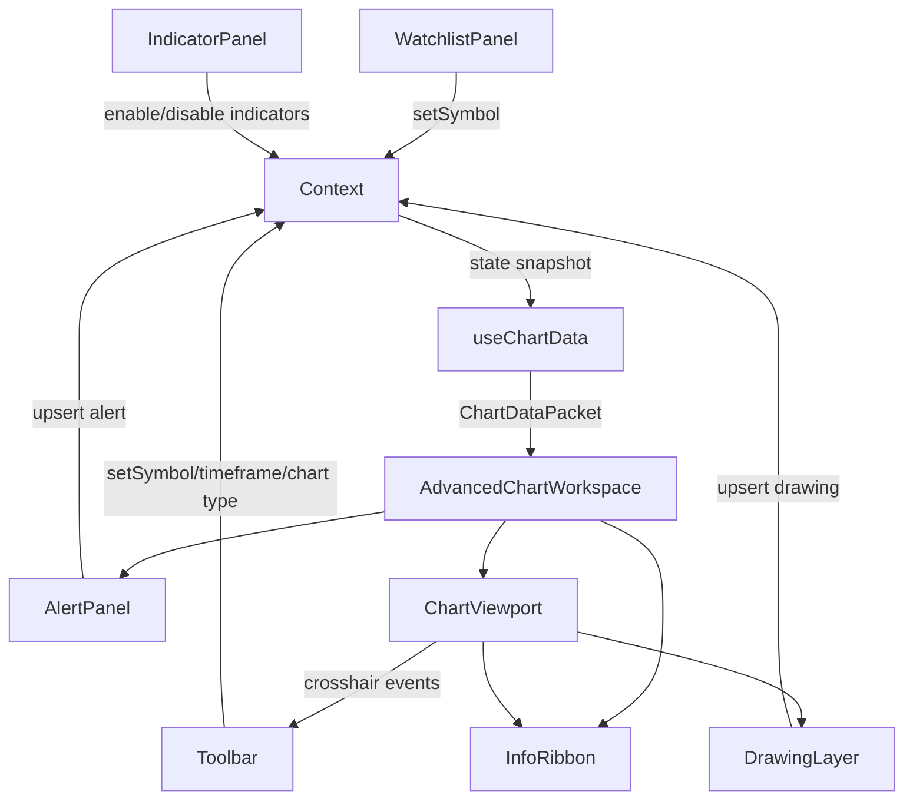

# Workspace Interaction Flow

This flowchart keeps the charting modules and docs aligned with the implementation. Update it whenever component responsibilities shift.

## Notes
- `useChartData` logs cache hits, refresh cycles, and errors for observability.
- `DrawingLayer` normalizes coordinates so resizing the layout keeps annotations intact.
- `AlertPanel` piggybacks on the same state tree, so alerts persist even when switching symbols during the session.
